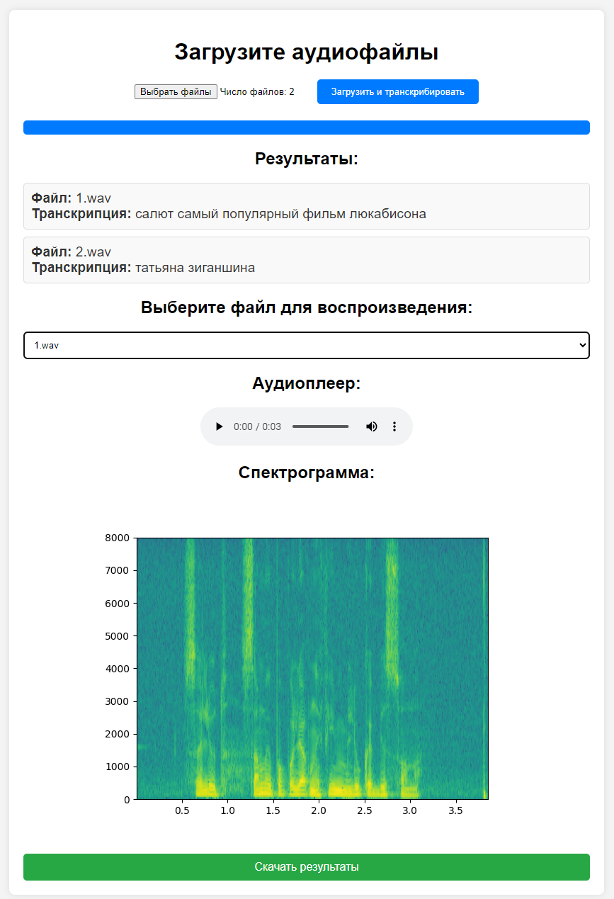

# Fine-tuning OpenAI Whisper "small" Model for Russian Language on Sber-golos Dataset

## Overview
This project involves fine-tuning the "small" model from OpenAI Whisper for the Russian language using the Sber-golos dataset. The original pre-trained model was sourced from [OpenAI Whisper GitHub](https://github.com/openai/whisper). The training data was obtained from the article [SberDevices on Habr](https://habr.com/ru/company/sberdevices/blog/559496/) and the [Sber-golos GitHub repository](https://github.com/sberdevices/golos?tab=readme-ov-file).

## Training Details
- **Dataset Used**: `train_crowd0.tar` (11 GB, 10% of the total data).
- **Training Duration**: 1522 minutes (16.42 epochs).
- **Best WER**: 22.899838% (achieved at step 5300, 6.8 epochs) on 5% of the test data (`test.tar` - 1.3 GB).
- **Comparison**: The original "small" model from OpenAI Whisper achieves WER = 62.96% on the same test data.
- **Final Model Performance**: WER ≈ 26% on 100% of the test data (`test.tar` - 1.3 GB).

## Model Artifacts
- **Notebook**: The `my_whisper.ipynb` notebook with the training code is available for download [here](https://disk.yandex.ru/d/k2H0gaLWm1uB5A).
- **Training Logs**: TensorBoard logs (`runs.zip`) can be downloaded [here](https://disk.yandex.ru/d/Ll-9QdJejKfgcw).
- **Checkpoint**: The best checkpoint (`checkpoint-6300.zip`) for continuing training is available [here](https://disk.yandex.ru/d/BVQlOYwQF6o8Dg).
- **Docker Deployment**: The saved model (`docker.zip`) with a web application deployment setup using Docker can be downloaded [here](https://disk.yandex.ru/d/6y-0dg-vg752Fw).
Build the image: docker build -t my_whisper-app .
Run the container without a GPU: docker run -d -p 80:80 my_whisper-app
Run the container using a GPU: docker run --gpus all -d -p 80:80 my_whisper-app

## Project Goals
One of the primary objectives of this project was to identify optimal hyperparameters for fine-tuning the "small" OpenAI Whisper model and achieve the best possible WER under limited dataset conditions. Due to the specific characteristics of the Sber-golos dataset, the fine-tuned model lost its ability to place punctuation.

## Notebook Availability
The `my_whisper.ipynb` notebook is available for download on GitHub.

---

## Русская версия

# Fine-tuning OpenAI Whisper "small" Model for Russian Language on Sber-golos Dataset

## Обзор
Этот проект включает дообучение модели "small" от OpenAI Whisper для русского языка на датасете Sber-golos. Исходная предобученная модель была взята с [GitHub OpenAI Whisper](https://github.com/openai/whisper). Данные для обучения были получены из статьи [SberDevices на Habr](https://habr.com/ru/company/sberdevices/blog/559496/) и репозитория [Sber-golos на GitHub](https://github.com/sberdevices/golos?tab=readme-ov-file).

## Детали обучения
- **Используемый датасет**: `train_crowd0.tar` (11 ГБ, 10% от общего объема данных).
- **Длительность обучения**: 1522 минуты (16.42 эпох).
- **Лучший WER**: 22.899838% (достигнут на шаге 5300, 6.8 эпох) на 5% тестовых данных (`test.tar` - 1.3 ГБ).
- **Сравнение**: Оригинальная модель "small" от OpenAI Whisper показывает WER = 62.96% на тех же тестовых данных.
- **Производительность финальной модели**: WER ≈ 26% на 100% тестовых данных (`test.tar` - 1.3 ГБ).

## Артефакты модели
- **Ноутбук**: Ноутбук `my_whisper.ipynb` с кодом обучения доступен для скачивания [здесь](https://disk.yandex.ru/d/k2H0gaLWm1uB5A).
- **Логи обучения**: Логи TensorBoard (`runs.zip`) можно скачать [здесь](https://disk.yandex.ru/d/Ll-9QdJejKfgcw).
- **Чекпоинт**: Лучший чекпоинт (`checkpoint-6300.zip`) для продолжения обучения доступен [здесь](https://disk.yandex.ru/d/BVQlOYwQF6o8Dg).
- **Docker-развертывание**: Сохраненная модель (`docker.zip`) с возможностью развертывания веб-приложения с использованием Docker доступна [здесь](https://disk.yandex.ru/d/6y-0dg-vg752Fw).
Сборка образа: docker build -t my_whisper-app .
Запуск контейнера без GPU: docker run -d -p 80:80 my_whisper-app
Запуск контейнера c использованием GPU: docker run --gpus all -d -p 80:80 my_whisper-app

## Цели проекта
Одной из основных целей проекта было нахождение оптимальных гиперпараметров для дообучения модели "small" от OpenAI Whisper и достижение наилучшего значения WER при ограниченном объеме данных. Из-за особенностей датасета Sber-golos модель утратила способность расставлять пунктуацию.

## Доступность ноутбука
Ноутбук `my_whisper.ipynb` доступен для скачивания на GitHub.
